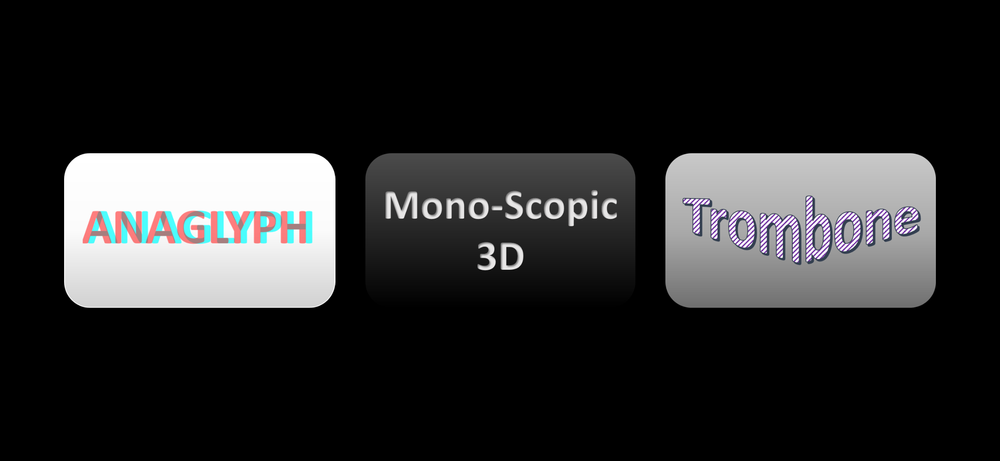
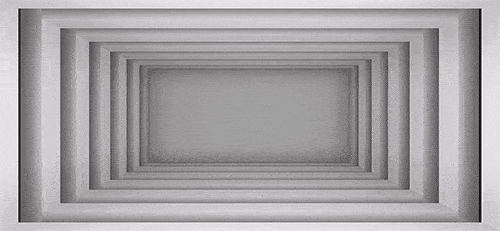
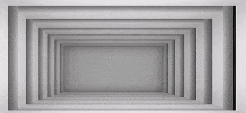
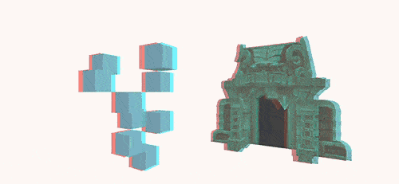
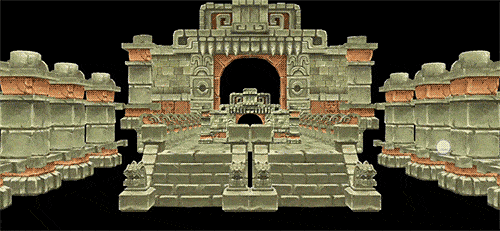

# PseudoParallax
### Observe Models in 3D-Parallax (Anaglyph, Mono-Scopic and Trombone) using Any Android Mobile Device

## GIFs
### Monoscopic 3D

- This feature uses **Gyro** for parallaxing effect, make sure the device supports **Gyro.**
- Slide the finger `Up/Down` to move the **Camera.** 

- Use **2 Fingers** to reset **Gyro.**
- `While turning around make sure, the device remains parallel to the face.`

### Anaglyph 3D

- Place any **3D Model** in the **Scene** to make **Anaglyph.**
- Rotate around using touch.
- Easy to use `Anaglyph Setup` Prefab, replaces your **Main Camera.**

### Trombone Prallax

- Easy to use Modular Script.
- Slide the finger `Up/Down` to perform **Trombone Parallaxing.** 

PS: Thanks for DevAssets for the models.

Copyright (c) 2019 Nikhil Sood

Permission is hereby granted, free of charge, to any person obtaining a copy
of this software and associated documentation files (the "Software"), to deal
in the Software without restriction, including without limitation the rights
to use, copy, modify, merge, publish, distribute, sublicense, and/or sell
copies of the Software, and to permit persons to whom the Software is
furnished to do so, subject to the following conditions:

The above copyright notice and this permission notice shall be included in all
copies or substantial portions of the Software.

THE SOFTWARE IS PROVIDED "AS IS", WITHOUT WARRANTY OF ANY KIND, EXPRESS OR
IMPLIED, INCLUDING BUT NOT LIMITED TO THE WARRANTIES OF MERCHANTABILITY,
FITNESS FOR A PARTICULAR PURPOSE AND NONINFRINGEMENT. IN NO EVENT SHALL THE
AUTHORS OR COPYRIGHT HOLDERS BE LIABLE FOR ANY CLAIM, DAMAGES OR OTHER
LIABILITY, WHETHER IN AN ACTION OF CONTRACT, TORT OR OTHERWISE, ARISING FROM,
OUT OF OR IN CONNECTION WITH THE SOFTWARE OR THE USE OR OTHER DEALINGS IN THE
SOFTWARE.
